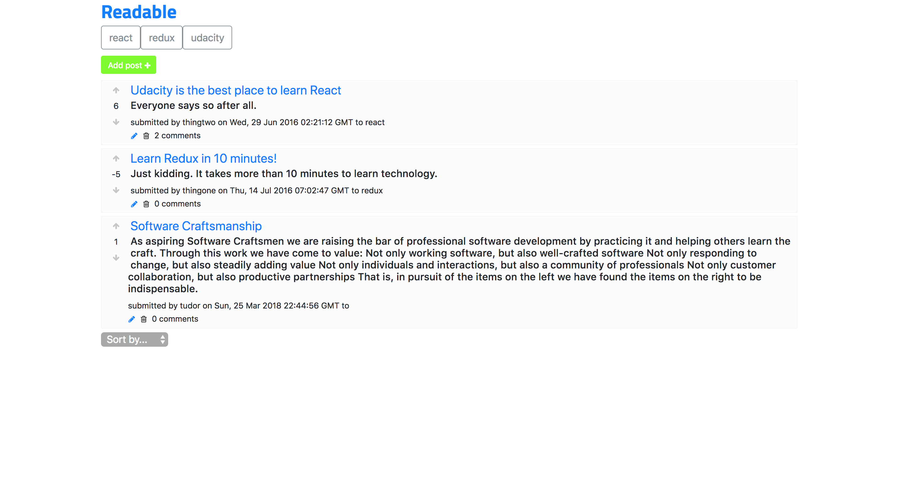
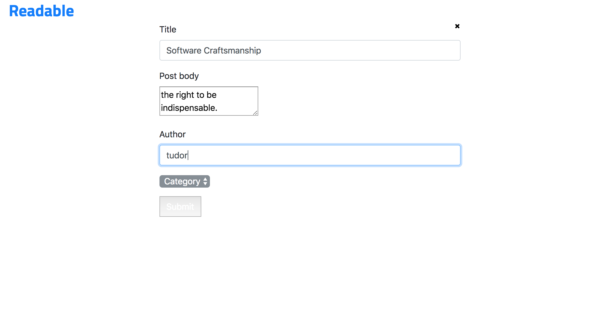
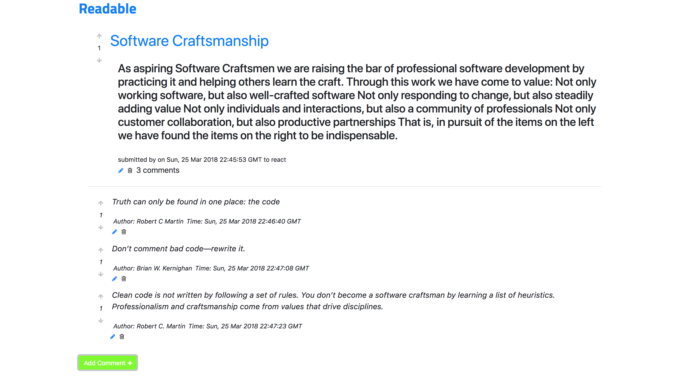
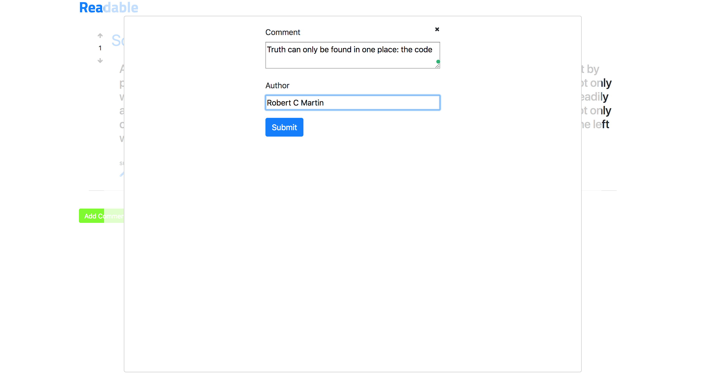
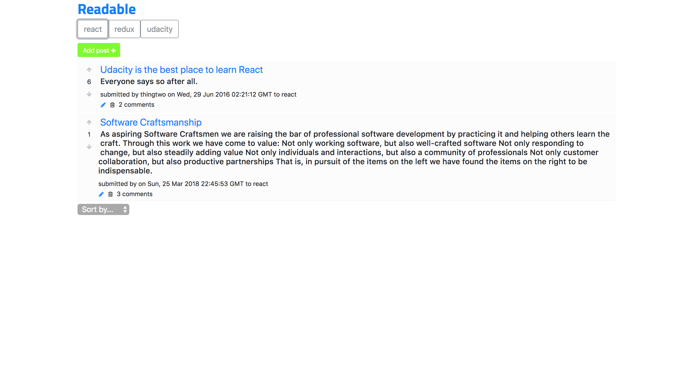

# Readable

This is the second project during the Udacity React Nanodegree course. 

Readable is a content and comment web app build with React and Redux. Users will be able to post content to predefined categories, comment on their posts and other users' posts, and vote on posts and comments. Users will also be able to edit and delete posts and comments.

This repository includes the code for both the backend API Server and the front-end portion of the project.

## Screenshots

Main page

Add Post

Post Page 

Add Comment

Category Page

## To start the project

* Install and start the API server
    - `clone the repo`
    - `cd api-server`
    - `npm install`
    - `node server`
* In another terminal window open the frontend folder and run the app
    - `cd frontend`
    - `npm install`
    - `npm start`

## Components

*  `<App/>`
*  `<Post/>`
*  `<PostsList/>`
*  `<PostForm/>`
*  `<PostsOrderChanger/>`
*  `<EditPostForm/>`
*  `<Comment/>`
*  `<AddComment/>`
*  `<CategoriesList/>`

## Extra info

The routing is handled by `react-router`. All the routes are created at the top level component `<App/>`.

I styled the app with `Bootstrap` and this represents my best styling efforts so far from all my projects. Although styling was secondary in importance compared to the features, I wanted to implement a good `UX` which from the feedback gathered so far I achieved.

This was a good learning opportunity as I had multiple options to style this application. Next time I want to experiment with `BEM` and yet another time to style each component individually keeping the `Css` in the compoment.

Some forms like `AddComment` are implemented using React `Modal` which is very useful and neat.

To write [semantic](https://en.wikipedia.org/wiki/Semantic_HTML) `HTML` I used `Fragment` which makes the `dom structure` more clear, removes unnecessary `div's` or elements and makes it easier to use by screen readers for example.

#### API Server

Information about the API server and how to use it can be found in its [README file](api-server/README.md).

### To do's

* Deploy to Heroku
* Extract small bits of code into their own component like `EditCommentForm`
* Write tests

